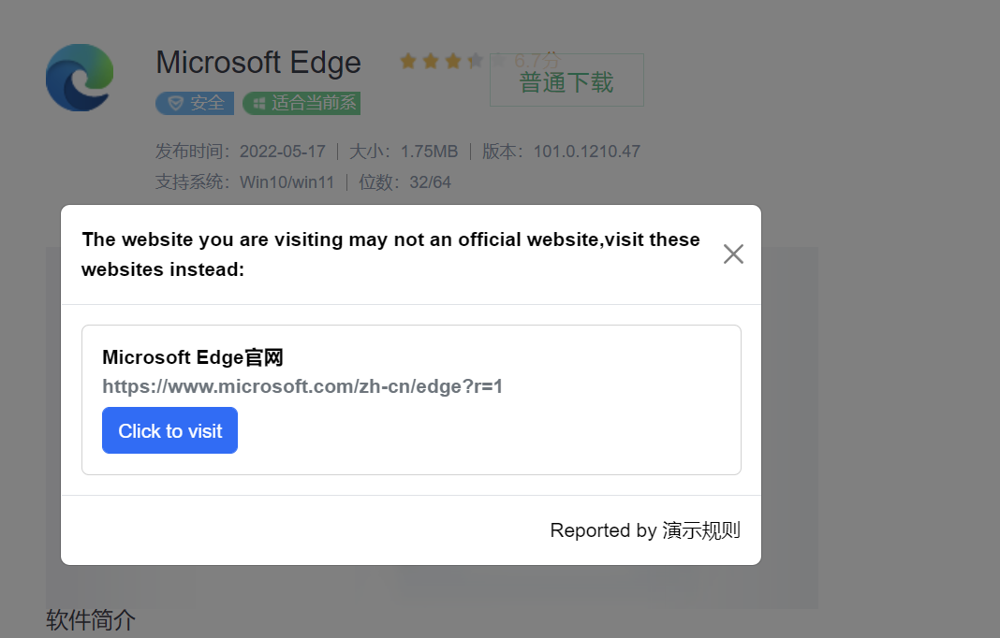
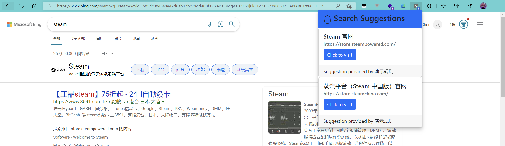
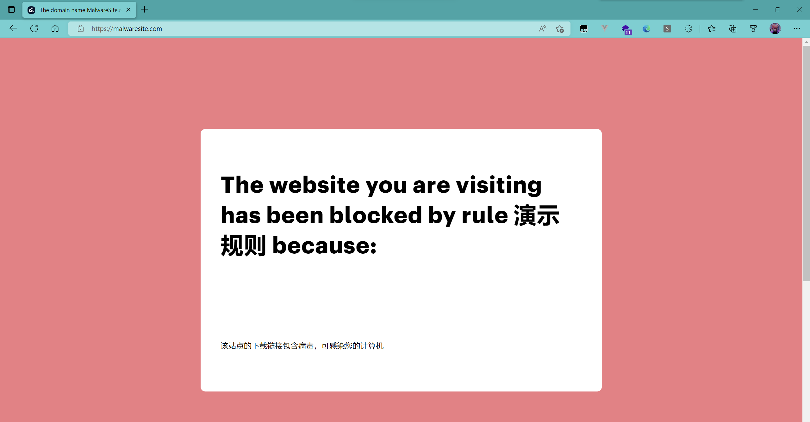
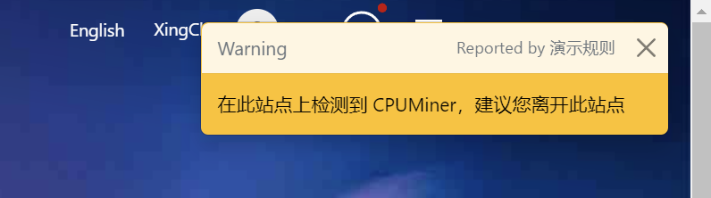
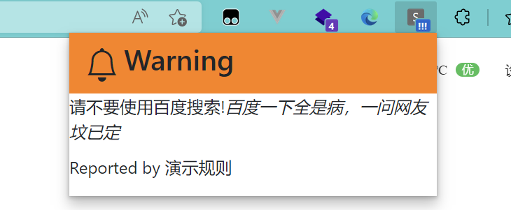

# Sitty


by HikariLan

## 介绍

Sitty 是一款网页浏览小助手拓展，他旨在帮助普通人远离恶意网站，提供更方便的浏览体验，令人人都能平等地享受网络生活的便利，不惧网络安全挑战。

## 功能

目前 Sitty 支持以下功能：

### 提供浏览建议

场景：访问下载站的时候自动识别所要下载的软件，并建议跳转到官网

例子：当在搜索引擎中搜索“Edge下载”并进入某下载站下载时，弹出窗口建议访问 Edge 官网下载。



### 提供搜索建议

场景：在特定语境下避免错误搜索

例子：当在搜索引擎中搜索“Steam下载”时，自动弹出 Steam 官网相关信息，方便用户快速访问。



### 阻止访问规则站点

场景：访问带毒，或者恶意网站的时候弹出遮罩或者模态对话框，建议用户访问其他网站

例子：访问虚假钓鱼网站时阻断连接并弹出对话框引导用户跳转到正确网站



### 完全可自定义的规则系统

Sitty 通过读取本地的数据文件来提供服务。在未来，Sitty 可能会增加远程拉取数据文件的功能。

```json
{
  "manifest": {
    "name": "演示规则",
    "author": "demo",
    "subscribe-link": "https://example.com/example-rules.json",
    "last-update": "时间戳",
    "description": "这是一个规则示例"
  },
  "browse-advise": [
    {
      "selector-url": [
        "baidu.com",
        "baidu.hk"
      ],
      "type": "popup",
      "content": "请不要使用百度搜索!<i>百度一下全是病，一问网友坟已定</i>"
    },
    {
      "selector-url": [
        "somewebsite.com/somepageincludingminerjs.html"
      ],
      "selector-request": [
        "www.webminer.com/cpu.js",
        "minerjs.com/miner.js"
      ],
      "type": "warning",
      "content": "在此站点上检测到 CPUMiner，建议您离开此站点"
    },
    {
      "selector-url": [
        "https://malwaresite.com"
      ],
      "type": "block",
      "content": "该站点的下载链接包含病毒，可感染您的计算机"
    },
    {
      "selector-url": [
        "mcbbs.com",
        "mcbbs.cc",
        "mcbbs.top"
      ],
      "type": "official-website",
      "content": [
        {
          "name": "我的世界中文论坛",
          "url": "https://www.mcbbs.net"
        },
        {
          "name": "网易我的世界论坛",
          "url": "https://mc.netease.com/"
        }
      ]
    },
    {
      "selector-dom": [
        {
          "dom": "/html/body",
          "expression": "搜狗输入法"
        }
      ],
      "type": "official-website",
      "content": [
        {
          "name": "搜狗输入法PC版官网",
          "url": "https://shurufa.sogou.com"
        }
      ]
    }
  ],
  "search-suggestions": [
    {
      "keyword": [
        "steam",
        "蒸汽平台"
      ],
      "content": [
        {
          "name": "Steam 官网",
          "url": "https://store.steampowered.com/"
        },
        {
          "name": "蒸汽平台（Steam 中国版）官网",
          "url": "https://store.steamchina.com/"
        }
      ]
    }
  ]
}

```

## 详细介绍

Sitty 将提供的以上功能分为两大类：“搜索建议”和“浏览建议”：

### 搜索建议

对于搜索建议，Sitty 会读取搜索引擎搜索的内容，并通过拓展 popup 窗口显示提示内容，并引导用户跳转到指定网页；在规则设定上，通过正则表达式来匹配搜索关键词；目前，Sitty 支持 Bing，Google，Baidu 三种搜索引擎。


### 浏览建议

对于浏览建议，Sitty 提供三种判断网页内容是否需要被拦截的方式：

1. URL 匹配，Sitty 会提取当前访问的网站 URL，并进行正则表达式匹配；
2. DOM 匹配，Sitty 加载 XPath 并判断指定 DOM 位置是否存在指定的文本（或该 DOM 位置存在）；
3. 浏览器请求匹配，Sitty 判断并拦截来自指定网站 URL 的请求。

同时，对于已被拦截的网页，Sitty 提供四种拦截提示：

1. "block"类型，使用网页遮罩的方式直接阻止用户访问网站；


2. "official-website"类型，使用模态对话框建议用户访问正确的网站；


3. "warning"类型，使用 Toast 提示用户网站可能不安全；



4. "popup"类型，通过 popup 窗口以提示用户；



四种拦截提示优先级从上至下递减，当多次被匹配时，只会显示优先级最高的拦截提示。

## 开源协议
本软件是自由软件，使用 GNU Public License, Version 3（GPLv3）协议开源。您可以在 [这里](LICENSE) 得到一份许可证的副本。
